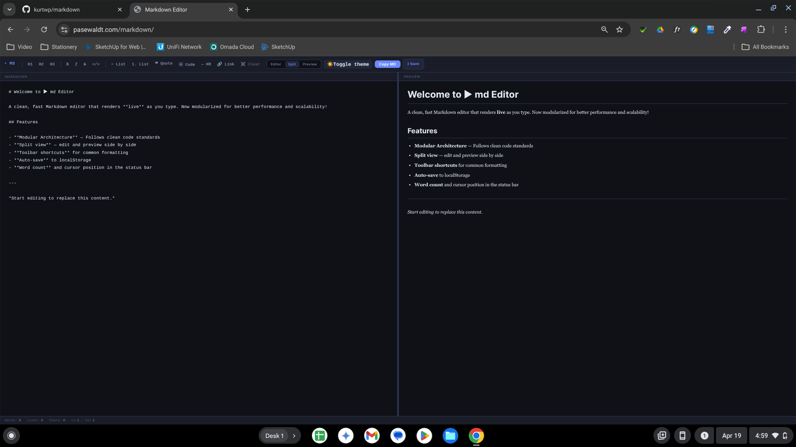

# ▸ md Editor
[](https://github.com/kurtwp/template-generator-2d/stargazers)
[](https://github.com/kurtwp/template-generator-2d/pulls) <br/>
A lightweight, professional Markdown editor with live preview, modular architecture, and a focused writing experience.<br>




## 🚀 One-Sentence Value Proposition
The fastest way to write, preview, and organize markdown documents in a clean, modular, and scalable environment.

## ✨ Core Features
- **Live Preview**: Real-time rendering as you type using `marked.js`.
- **Split View & Toggles**: Switch between Editor, Preview, and Split views seamlessly.
- **Modular Architecture**: Built with modern ES Modules for scalability (State, UI, Physics, Interactions).
- **Toolbar Shortcuts**: Quick commands for headers, bold, italics, lists, and code fences.
- **Auto-Save**: Automatic persistence to `localStorage` to prevent data loss.
- **Statistics**: Word count, line count, and cursor position tracking.

## 🛠️ Tech Stack
- **Languages**: HTML5, CSS3, JavaScript (ES6+ Modules)
- **Engine**: `marked.js` (Markdown parsing)
- **Architecture**: Modular Component-based UI

## 🏁 Getting Started

### Prerequisites
- A modern web browser.
- A local web server (to handle ES Module imports).

### Installation
1. Clone the repository:
   ```bash
   git clone https://github.com/user/markdown-editor.git
   ```
2. Navigate to the project directory:
   ```bash
   cd markdown-editor
   ```

### Usage
Since the project uses ES Modules, you must run it from a local server:
```bash
# Example using Python
python -m http.server 8000

# Example using Node (serve)
npx serve .
```
Then open `http://localhost:8000/editor.html` in your browser.

## 📁 Project Structure
```text
/
├── editor.html      # Main application entry
├── src/
│   ├── main.js      # Bootstrapper
│   ├── state.js     # Shared application state
│   ├── ui/          # UI Component modules
│   ├── physics/     # (Upcoming) Physics engine
│   └── interactions/# (Upcoming) Event mechanics
└── README.md        # Professional documentation
```

## 🤝 Contribution
Brief guide on how to contribute:
- Open an issue for bugs or feature requests.
- Submit PRs for improvements.
- Follow the `Architecture & Modularization` rules (keep scripts under 200 lines).

---

> [!TIP]
> Use `Ctrl+S` to quickly download your document as a `.md` file!
